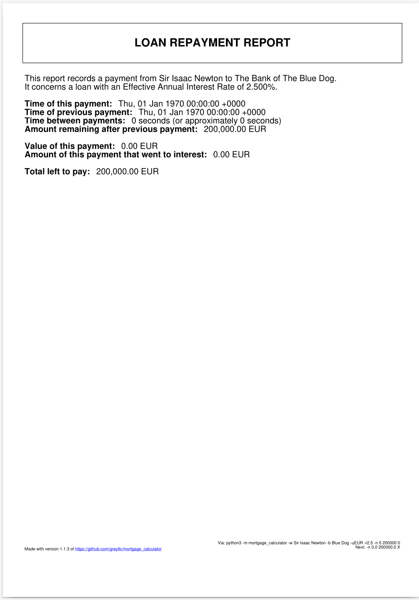

# mortgage_calculator
A tool that crunches mortgage numbers

## Installation
```
python3 -m pip install --upgrade https://github.com/greyltc/mortgage_calculator/releases/latest/download/mortgage_calculator-0.0.0-py3-none-any.whl
```

## Usage
```
$ python3 -m mortgage_calculator --help
usage: python -m mortgage_calculator [-h] [--size SIZE] [--rate RATE]
                                     [--compound-period COMPOUND_PERIOD]
                                     [--max-payment-size MAX_PAYMENT_SIZE]
                                     [--payment-period PAYMENT_PERIOD]
                                     [--duration DURATION] [--unit UNIT]
                                     [--bank-name BANK_NAME]
                                     [--borrower-name BORROWER_NAME]
                                     [--register-new-payment last_timestamp last_remaining payment_size]
                                     [--verbose]

crunch mortgage numbers

options:
  -h, --help            show this help message and exit
  --size, -s SIZE       mortgage size (default: 100000)
  --rate, -r RATE       advertised interest rate [percent] (default: 4.5)
  --compound-period, -c COMPOUND_PERIOD
                        compoind period [s] (default: 31449600.0)
  --max-payment-size, -p MAX_PAYMENT_SIZE
                        fix the upper limit for a single payment (default:
                        10000)
  --payment-period, -i PAYMENT_PERIOD
                        time between regular payments [s] (default: 2620800.0)
  --duration, -d DURATION
                        fix the duration of the loan (default: 0 seconds)
  --unit, -u UNIT       monetary unit (default: EUR)
  --bank-name, -b BANK_NAME
                        name of loaner (default: None)
  --borrower-name, -w BORROWER_NAME
                        name of borrower (default: None)
  --register-new-payment, -n last_timestamp last_remaining payment_size
                        register a payment against an existing loan and
                        generate a payment report pdf (default: None)
  --verbose, -v         print more details (default: False)
```

## Example Usage
### Fixed payment simulation
#### 500/month
```
$ python3 -m mortgage_calculator --size 200000 --rate 2.5 -p 500
Effective Annual Rate (EAR): 2.499999999999991 percent
Borrowed: 200000.0 EUR
Pre-set maximum payment: 500.0 EUR
Total paid after 70 years, 21 weeks and 4 days: 422045.5 EUR
With payments made every 4 weeks, 2 days and 8 hours
```
### Fixed length simulation
#### 10 years
```
$ python3 -m mortgage_calculator --size 200000 --rate 2.5 -p 0 -d 10y
Effective Annual Rate (EAR): 2.499999999999991 percent
Borrowed: 200000.0 EUR
Pre-set maximum mortgage length: 10 years
Maximum duration loan of 10 years
With payments made every 4 weeks, 2 days and 8 hours
Results in 120 payments and an actual duration of 10 years
Discovered payment value: 1882.83 EUR
Total paid after 10 years, 4 weeks and 2 days: 225940.26 EUR
With payments made every 4 weeks, 2 days and 8 hours
```
#### 2.5 years
```
$ python3 -m mortgage_calculator --size 200000 --rate 2.5 -p 0 -d 2.5y
Effective Annual Rate (EAR): 2.499999999999991 percent
Borrowed: 200000.0 EUR
Pre-set maximum mortgage length: 2 years and 26 weeks
Maximum duration loan of 2 years and 26 weeks
With payments made every 4 weeks, 2 days and 8 hours
Results in 30 payments and an actual duration of 2 years and 26 weeks
Discovered payment value: 6881.63 EUR
Total paid after 2 years, 30 weeks and 2 days: 206449.03 EUR
With payments made every 4 weeks, 2 days and 8 hours
```
### New payment registration with report generation
```bash
$ python3 -m mortgage_calculator -w "Isaac Newton" -b "Blue Dog" -uEUR -r2.5 -n 0 200000 0
Effective Annual Rate (EAR): 2.499999999999991 percent
Payment Report file written to file:///tmp/1970-01-01_Isaac_Newton_paid_0EUR.pdf
```

